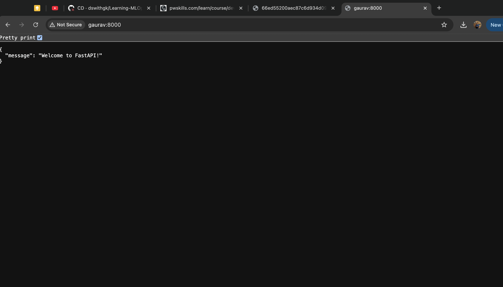

## Task 1: Set Up a CI Pipeline

Objective: Set up a basic CI pipeline that builds a project automatically whenever new code is pushed.

Tools: GitHub Actions, Jenkins, GitLab CI, or CircleCI

Instructionsl
- Create a simple application (use Node.js, Python, or Java)$
- Set up a repository on GitHub or GitLab.
- Configure a CI tool to automatically build the application whenever new code is pushed to the repository.
- Document each step with screenshots showing the pipeline running.


###
See app here : https://github.com/dswithgk/GithubActions




### Code fro CI/CD
```bash
name: "Assignment 1"

on:
  push:
    branches:
      - main

jobs:
    build:
        runs-on: ubuntu-latest
        steps:
            - name: Checkout code
              uses: actions/checkout@v2
            - name: Set up Python
              uses: actions/setup-python@v2
              with:
                python-version: '3.x'
            - name: Install dependencies
              run: |
                cd SimpleApp
                python -m pip install --upgrade pip
                pip install -r requirements.txt
            - name: Upload Artifact
              uses: actions/upload-artifact@v2
              with:
                name: SimpleApp
                path: SimpleApp
    deploy:
        runs-on: ubuntu-latest
        needs: build
        steps:
            - name: Download Artifact
              uses: actions/download-artifact@v2
              with:
                name: SimpleApp
            - name: Set up Python
              uses: actions/setup-python@v2
              with:
                python-version: '3.x'
            - name: Install dependencies
              run: |
                cd SimpleApp
                python -m pip install --upgrade pip
                pip install -r requirements.txt
            - name: Deploy to AWS EC2
              run: |
                echo "Deploying to AWS EC2"
```


# Task 3: Write Unit Tests for an Application

Objective: Write unit tests for a simple application and integrate them into a CI pipeline.

Tools: Jest (JavaScript), JUnit (Java), pytest (Python)


Instructionsl
- Create a small application (e.g., a calculator, to-do list, or API)$
- Write unit tests for the core functions (e.g., add, delete, or update functions)
- Integrate these tests into a CI pipeline using GitHub Actions, Jenkins, or GitLab CI
- Document your work with screenshots showing the tests running in the CI pipeline.

